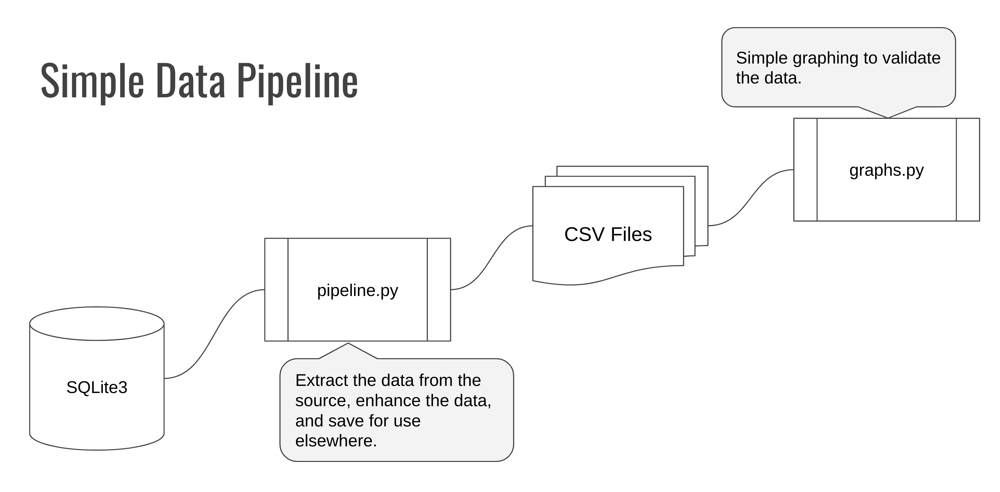

# Music Challege 2
Coding Challenge for Code Louisville Data Analysis 2 Course. The goal of this challenge is to get hands-on practice with using SQL from a Python script.

## Introduction

 The starting point for this exercise a simple data pipeline that is used to extract sales information from a database and prepare it for use in dashboard reports. In this challenge you will be adding features to the existing data pipeline. 

 

 Data Pipeline Steps
 
 1. Extract monthly sales data
 1. Save monthly sales data as a CSV 
 1. Extract sales data for top N artists
 1. Save sales data for top N artists as CSV

## Existing pipeline.py Functions

| Function | Parameters | Returns | Description |
| ----------- | ----------- | ----------- | ----------- |
| `get_connection()` | Path to SQLite file | Connection object | Utility function - returns a connection to SQLite database |
| `configure_logging()` | N/A | None | Utility function - configures logging for data pipeline |
| `get_sales_by_month_sql()` | N/A | DataFrame | Data extract (Month, Quantity, TotalSales) using SQL to format and aggregate data |
| `get_sales_by_month_pd()` | N/A | DataFrame | Data extract (Month, Quantity, TotalSales) using Pandas to format and aggregate data |
| `get_top_artists_by_sales()` | Number Results | DataFrame | Data extract (ArtistName, Quantity, TotalSales) |
| `main()` | N/A | None | controls/runs the pipeline process |

 In addition to the `pipeline.py` file, there is also a `graphs.py` file that shows some simple graphing of the data in the CSV files.

## Database Schema

Music database schema for reference:
 
 You can use the query tool from [SQLite Tutorial](https://www.sqlitetutorial.net/tryit/) to test your queries.
## Challenges
### Challenge 1: Add Tracks by Genre function

- Add a new function to `pipeline.py` called `get_tracks_by_genre()` to get the number of Tracks by Genre
- The resulting DataFrame should include Genre, NumTracks
- Save the data to a CSV file called `tracks_by_genre.csv`

### Challenge 2: Add Annual Sales function
- add a new function to `pipeline.py` called `get_annual_sales_by_month()` that takes a Year and returns a dataframe with the sales for the specified year
- The function should take a Year as a parameter
- The function should return a DataFrame
- The resulting Dataframe should include Month, Quantity, UnitPrice
- Save the data to a CSV file called 'sales_by_month_{year}.csv

### Challenge 3: Add Sales by Quarter function

- Add a `get_sales_by_quarter()` function in `pipeline.py` 
- The function should take a Connection as a parameter
- The function should return a DataFrame
- Resulting DataFrame should include (Quarter, Quantity, TotalSales)
- Quarters should be formatted as: 2011Q1, 2011Q2, etc.
- Tip: you calculate the Quarter in SQL or in Pandas.
    - [CASE Statements in SQL](https://mode.com/sql-tutorial/sql-case/)
    - [Calculating Quarters in Pandas](https://datascienceparichay.com/article/get-quarter-from-date-in-pandas/)
- Save the data to CSV file called `quarterly_sales.csv` 

### Challenge 4: Refactor `get_top_artists_by_sales()` to use Pandas for aggregation
- Add a `get_top_artists_by_sales_pd()` function to the `pipeline.py` file
- Modify the SQL statement to remove the `SUM()` functions
- Use Pandas to calculate the TotalSales and Quantity
- Use Pandas to rename the columns as needed
- Resulting DataFrame should include (Month, Quantity, TotalSales)

### Bonus: Graphing 
- Update the `graphs.py` file to include a graph of sales by quarter.
- Update the `graphs.py` file to include a graph of sales by Year.
- Update `graphs.py` to include a graph of the total number of tracks by Genre.

## Instructions

1. clone the repo
1. create a virtual environment
1. install the required libraries from requirements.txt
1. run the pipeline.py file to generate the CSV file(s)
1. run the graphs.py file to see the example graphs
1. modify the pipeline.py and graphs.py files to complete the challenges and bonus.

## Resources

- [Plotly Documentation](https://plotly.com/python/basic-charts/)
- [Python Logging](https://docs.python.org/3/howto/logging.html)
- [SQL CASE Statements](https://mode.com/sql-tutorial/sql-case/)
- [Calculating Quarters from Dates in Pandas](https://datascienceparichay.com/article/get-quarter-from-date-in-pandas/)
- [SQLite Tutorial Query Tool](https://www.sqlitetutorial.net/tryit/)
- [Pandas DatetimeIndex](https://pandas.pydata.org/docs/reference/api/pandas.DatetimeIndex.html)
